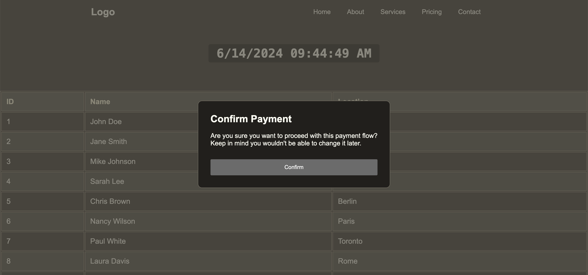

# Custom Web Components

Explore our collection of reusable custom web components tailored to enhance web applications. This repository includes essential components such as headers for navigation, dynamic tables for data visualization, modals for interactive user interfaces, tooltips for additional information display, and a time and date component for real-time updates. Integrate these components seamlessly and **regardless of the frontend frameworks** into your projects to improve functionality and user experience.

- **Header Component**: Customizable header section.
- **Time and Date Component**: Display current time and date.
- **Modal Component**: Reusable modal dialogs.
- **Table Component**: Dynamically render tables based on JSON data.
- **Tooltip Component**: Display additional information on hover.

## Usage

Include the components in your HTML and provide the required attributes.

## License

This project is licensed under the MIT License.
